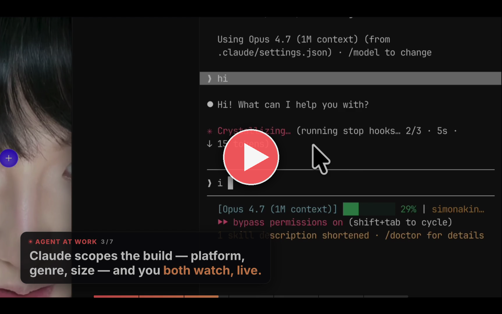

<div align="center">


# Coterm

**A native macOS terminal and browser workspace for AI coding agents, with self-hosted real-time collaboration.**

[](https://github.com/mana-am/coterm/releases)
[](https://github.com/mana-am/coterm/releases/latest)
[](./LICENSE)
[](./coterm/instruction.md)

[English](README.md) | [简体中文](README.zh-cn.md) | [日本語](README.ja.md) | [한국어](README.ko.md) | [Русский](README.ru.md)

[Download](https://github.com/mana-am/coterm/releases/latest) · [Installation](#installation) · [Self-host Collaboration](./coterm/instruction.md) · [Attribution](./ATTRIBUTION.md)

</div>

---

<div align="center">

<a href="https://youtu.be/13qSk6Fgct0">
  
</a>

<sub>▶ <a href="https://youtu.be/13qSk6Fgct0">Watch the demo — two developers driving the same Claude Code session live</a></sub>

</div>

---

Coterm is for developers who run Claude Code, Codex, OpenCode, Gemini CLI, Aider, Amp, Cursor Agent, or other terminal-based coding agents in parallel.

It gives you a native macOS terminal, split workspaces, browser panes, notifications, local automation, and self-hosted collaboration without requiring a Coterm-hosted account service.

## Installation

Coterm has two pieces:

- **Mac app** — the native terminal/browser workspace you run locally.
- **Self-hosted collaboration backend** — optional Cloudflare Workers you deploy yourself when you want room sharing, presence, approval flows, or preview sharing.

### TL;DR

| You want | Do this | What you get |
| :--- | :--- | :--- |
| Use Coterm locally | Download the latest DMG | `Coterm.app` for macOS |
| Use collaboration | Deploy the self-host backend | Your own relay, control plane, and presence workers |
| Build from source | Clone with submodules and run setup | A local Debug or Release build |

### For Humans

**Recommended: let an LLM agent install and configure collaboration for you.** The self-host backend touches Cloudflare login, Workers deploy order, Durable Object migrations, worker URLs, and client config. An agent can read the full guide and follow the exact steps.

Paste this prompt into Claude Code, AmpCode, Cursor, Codex, or another coding agent:

```text
Install Coterm and configure its self-hosted collaboration backend by following the instructions here:
https://raw.githubusercontent.com/mana-am/coterm/refs/heads/main/coterm/instruction.md

Coterm is self-host only. Do not configure hosted sign-in, dashboard.coterm.cc, Clerk, Stack Auth, Stripe, or any official hosted Coterm backend. Use my Cloudflare account, deploy the self-host backend, capture the printed COTERM_API_BASE_URL, COTERM_COLLABORATION_RELAY_URL, and COTERM_PRESENCE_BASE_URL values, then configure my local Coterm client with those values.
```

If you only want the macOS app:

```text
https://github.com/mana-am/coterm/releases/latest/download/coterm-macos.dmg
```

Open the DMG and drag `Coterm.app` into `/Applications`.

The first public builds may be ad-hoc signed rather than Apple Developer ID notarized. If macOS blocks the first launch, right-click `Coterm.app`, choose **Open**, and confirm in System Settings.

### For LLM Agents

Fetch the installation guide and follow it end to end:

```bash
curl -fsSL https://raw.githubusercontent.com/mana-am/coterm/refs/heads/main/coterm/instruction.md
```

If the raw URL is unavailable because the user is in a local checkout, read `coterm/instruction.md` directly.

Important rules:

- Coterm collaboration is self-host only.
- Do not look for or configure an official hosted Coterm backend.
- Do not configure hosted sign-in or `dashboard.coterm.cc`.
- Use the user's Cloudflare account.
- Prefer `cd coterm && bun install && bunx wrangler login && bun run deploy:self-host`.
- Capture and report `COTERM_API_BASE_URL`, `COTERM_COLLABORATION_RELAY_URL`, and `COTERM_PRESENCE_BASE_URL`.
- Use `bun run deploy:self-host -- --print-config` to reprint saved values.
- Use `bun run doctor:self-host` to diagnose an existing deployment.
- Use `bun run configure:client` for a DEBUG Coterm client; add `-- --guest-id <name>` only to override the automatic local guest identity.

## What Is Coterm?

Coterm is an open-source macOS app for terminal-first AI coding workflows.

It combines:

- native terminal rendering powered by libghostty;
- vertical workspaces, tabs, and split panes;
- in-app browser panes that agents can inspect and control;
- notification rings and unread state for long-running agent sessions;
- a local CLI and socket API for automation;
- optional self-hosted real-time collaboration for shared agent rooms.

## Collaboration Is Self-Hosted

Coterm does not ship with a public hosted collaboration backend. If you want room sharing, deploy the backend in your own Cloudflare account:

```bash
cd coterm
bun install
bunx wrangler login
bun run deploy:self-host
```

The deploy script prints the client URLs you need:

```text
COTERM_API_BASE_URL=...
COTERM_COLLABORATION_RELAY_URL=...
COTERM_PRESENCE_BASE_URL=...
```

See [coterm/instruction.md](./coterm/instruction.md) for the full install guide.

## Share Security

Coterm room sharing uses more than a short room code.

When a host shares a room, Coterm creates:

- a short room code for usability;
- a high-entropy share secret for join requests;
- a relay grant for the current host session.

Guests submit the room code plus secret. The room owner must approve the pending request before the guest receives a relay grant. A plain room code is not enough to join.

## Features

### Agent Workspaces

Run multiple coding agents side by side. Coterm keeps workspaces, tabs, panes, directories, and notifications visible without forcing agents into a hidden orchestration layer.

### Browser Panes

Open a browser next to a terminal. Agents can inspect the accessibility tree, click elements, fill forms, evaluate JavaScript, and work against local development servers.

### Notifications

Coterm listens for terminal notification sequences and exposes `coterm notify` for agent hooks. Panes and tabs light up when an agent needs attention.

### CLI Automation

Use the `coterm` CLI and local socket API to create workspaces, split panes, send keystrokes, open URLs, and script workflows.

### Ghostty Rendering

Coterm uses libghostty for terminal rendering and reads Ghostty-style terminal configuration for fonts, themes, and colors.

## Lineage And Upstream Relationship

Coterm is an independent open-source distribution built from the Mosaic/cmux code lineage. It keeps the terminal, workspace, pane, browser, command palette, settings, and Ghostty integration foundation, then changes the product identity and deployment model around Coterm.

Coterm is not an official Mosaic or cmux release and should not be represented as endorsed by those projects. Mosaic and cmux names, logos, domains, hosted services, and trademarks remain separate from Coterm.

### Mosaic

Mosaic is the original open-source project this codebase descends from. Coterm preserves the required license notices and attribution while using its own app name, icon, bundle identity, domains, update feeds, docs, packaging, and release channel.

See [ATTRIBUTION.md](./ATTRIBUTION.md) for formal attribution and redistribution notes.

### cmux

cmux is the current upstream code line for many terminal/workspace/browser improvements. Coterm may selectively port upstream fixes from cmux, but not by blindly merging cmux over Coterm.

Some legacy `cmux` names remain intentionally as compatibility shims for old helpers, wire formats, or artifact names. They are tracked in [docs/coterm-cmux-compat.md](./docs/coterm-cmux-compat.md). The upstream sync policy lives in [docs/upstream-cmux-sync.md](./docs/upstream-cmux-sync.md).

### Ghostty

Coterm uses Ghostty as its terminal rendering foundation through libghostty/GhosttyKit. Ghostty provides the low-level terminal emulator engine, rendering behavior, shell integration pieces, and Ghostty-style configuration compatibility. Coterm provides the macOS workspace shell around it.

Ghostty is a third-party dependency/submodule with its own license and upstream project. Coterm is not a Ghostty distribution; it embeds and integrates Ghostty technology as part of a broader agent workspace app.

## Build From Source

Clone the repository with submodules:

```bash
git clone --recursive https://github.com/mana-am/coterm.git
cd coterm
./scripts/setup.sh
```

Build a local tagged debug app:

```bash
./scripts/reload.sh --tag local
```

For a release-style unsigned local build:

```bash
xcodebuild -project coterm.xcodeproj \
  -scheme coterm \
  -configuration Release \
  -destination 'platform=macOS' \
  CODE_SIGNING_ALLOWED=NO \
  build
```

Official signed and notarized releases require Apple Developer credentials and should use the release workflow.

## Release Hardening

Before cutting a public release, run the release audit and the two-app collaboration checklist:

```bash
./scripts/coterm-release-audit.sh
./scripts/coterm-collaboration-two-app-check.sh
```

The audit checks the public repo/download identity, self-host-only defaults, app-localized Mosaic branding, and release asset naming. The two-app helper builds isolated `host-test` and `guest-test` DEBUG apps and prints the manual collaboration regression path for create, join, owner approval, invite-secret handling, and stop sharing.

Release packaging also requires `zig 0.15.2` for the bundled Ghostty CLI helper. Do not publish a macOS asset from a machine or CI runner with a different Zig version.

If the working tree contains local deployment overrides such as a personal `wrangler.toml`, either clean them before tagging or run the audit with `COTERM_RELEASE_AUDIT_ALLOW_DIRTY=1` only for an exploratory check. Do not tag from a dirty tree.

## Documentation

- [Self-host collaboration install guide](./coterm/instruction.md)
- [Self-host backend docs](./coterm/docs/self-hosting.md)
- [Client setup](./coterm/docs/client-setup.md)
- [Preview sharing](./coterm/docs/preview-sharing.md)
- [Attribution](./ATTRIBUTION.md)
- [Coterm/cmux compatibility register](./docs/coterm-cmux-compat.md)
- [Upstream cmux sync policy](./docs/upstream-cmux-sync.md)
- [Repository map](./docs/repo-map.md)

## License And Attribution

Coterm is open source under GPL-3.0-or-later. See [LICENSE](./LICENSE).

See [ATTRIBUTION.md](./ATTRIBUTION.md) for upstream attribution, trademark, and redistribution notes.
